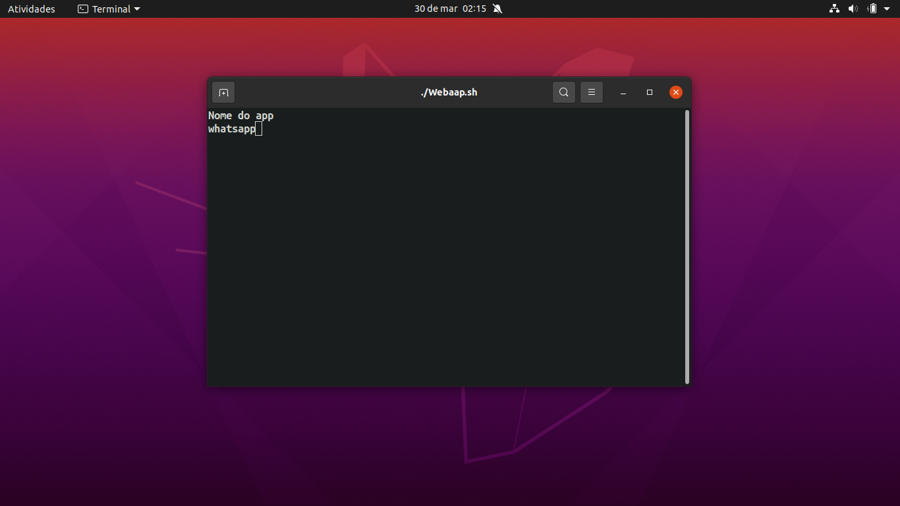
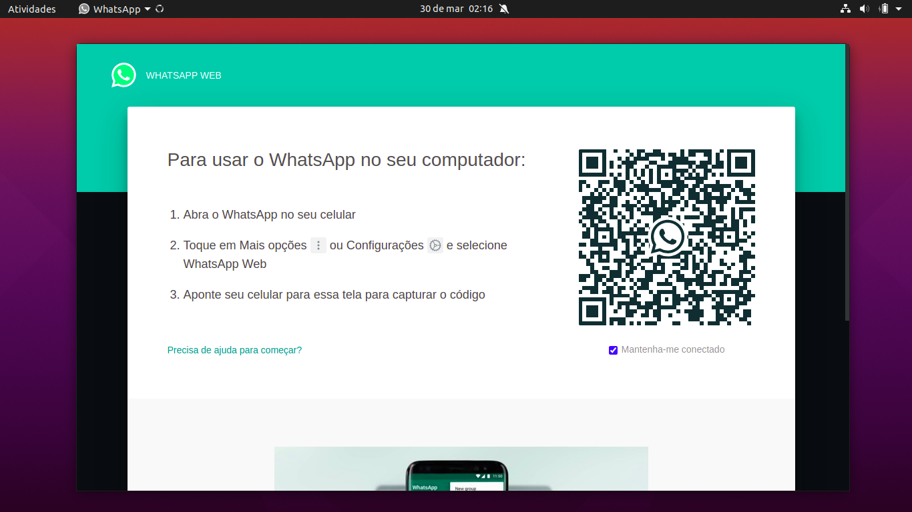

# Webaap

Script to create webaap automatically using nativefier

Webaap consist on create a desktop application from website.
The website morph in a executable and stay in menu app
An important observation, you can't run a Webaap in Windows,
only on linux or an apple system, too is nescesary install the Nativefier, 
because the script use he to create a Webaap

### How to run 

to run just type


```bash
./Webaap.sh
```


if don't have permission type


```bash
sudo chmod +x Webaap.sh
```


# Available arguments 

## pt-br version `-pt`

To run the pt-br version type

`./Webaap.sh -pt`

## Aplication version `-v`

Show the app version


<br/>

# Nativefier

You need install Nativefier to create a Webaap :>

[Nativefier Github](https://github.com/nativefier/nativefier)

# Webaap




